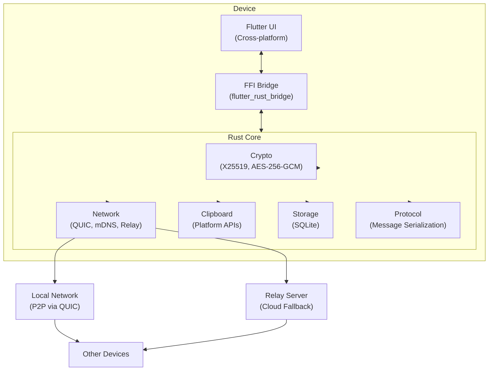
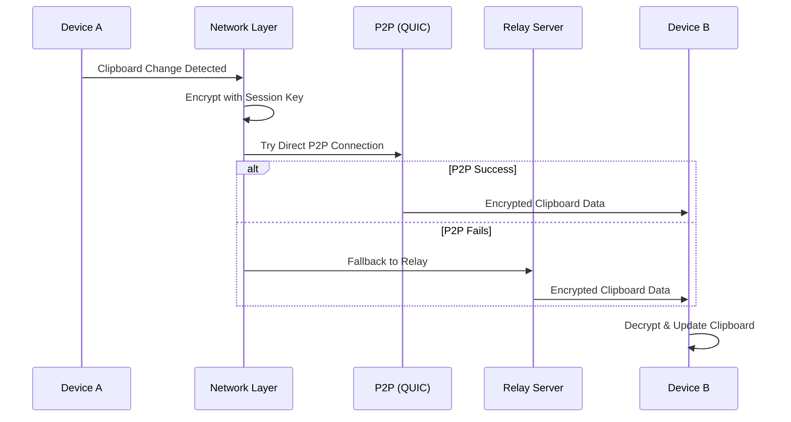

# Toss - Project Context

## Project Overview
**Toss** is a cross-platform clipboard sharing application that enables secure, encrypted clipboard synchronization between devices on local networks with cloud relay fallback.

## Repository
This project is published on **GitHub** as an open-source project. All contributions, issues, and releases are managed through GitHub.

### GitHub Requirements
- All code must include appropriate documentation
- README.md with installation and usage instructions
- LICENSE file (choose appropriate open-source license)
- CONTRIBUTING.md with contribution guidelines
- CODE_OF_CONDUCT.md
- Issue and PR templates in `.github/` directory
- GitHub Actions for CI/CD (see below)

### Commit Guidelines
- Use [Conventional Commits](https://www.conventionalcommits.org/) format
- Format: `<type>(<scope>): <description>`
- Types: `feat`, `fix`, `docs`, `style`, `refactor`, `test`, `chore`, `ci`
- Examples:
  - `feat(crypto): add X25519 key exchange`
  - `fix(clipboard): handle empty clipboard on Windows`
  - `docs(readme): add installation instructions`
  - `ci(actions): add Flutter build workflow`

### GitHub Actions Workflows
- **CI Pipeline** (`.github/workflows/ci.yml`)
  - Runs on every push and PR
  - Rust: `cargo fmt --check`, `cargo clippy`, `cargo test`
  - Flutter: `flutter analyze`, `flutter test`
  - Security: `cargo audit` for dependency vulnerabilities

- **Build & Release** (`.github/workflows/release.yml`)
  - Triggered on version tags (`v*.*.*`)
  - Build artifacts for all platforms
  - Create GitHub Release with binaries
  - Publish to app stores (optional)

- **Nightly Builds** (`.github/workflows/nightly.yml`)
  - Runs on every push to main branch
  - Builds all platforms (Linux, macOS, Windows, Android)
  - Creates/updates `nightly` pre-release on GitHub Releases page

- **Security** (`.github/workflows/security.yml`)
  - Runs `cargo audit` for dependency vulnerabilities
  - Dependency review on pull requests

## Architecture

### Core Components
- **Rust Core Library**: Handles networking, encryption, device discovery, and clipboard operations
- **Flutter UI**: Cross-platform user interface for all supported platforms
- **FFI Bridge**: Connects Flutter to the Rust core via `flutter_rust_bridge`

### Architecture Diagram



### Communication Flow



### Directory Structure
```
toss/
├── .github/
│   ├── workflows/
│   │   ├── ci.yml          # Continuous integration
│   │   ├── release.yml     # Release builds
│   │   └── nightly.yml     # Nightly builds
│   ├── ISSUE_TEMPLATE/
│   │   ├── bug_report.md
│   │   └── feature_request.md
│   └── PULL_REQUEST_TEMPLATE.md
├── rust_core/              # Rust library
│   ├── src/
│   │   ├── lib.rs
│   │   ├── crypto/         # Encryption (AES-256-GCM, X25519)
│   │   ├── network/        # P2P, mDNS discovery, relay client
│   │   ├── clipboard/      # Platform clipboard access
│   │   └── protocol/       # Wire protocol definitions
│   └── Cargo.toml
├── flutter_app/            # Flutter application
│   ├── lib/
│   │   ├── main.dart
│   │   ├── screens/
│   │   ├── widgets/
│   │   ├── services/
│   │   └── ffi/            # Rust FFI bindings
│   └── pubspec.yaml
├── relay_server/           # Optional cloud relay server (Rust)
├── docs/
├── README.md               # Project overview and quick start
├── LICENSE                 # Open-source license
├── CONTRIBUTING.md         # Contribution guidelines
├── CODE_OF_CONDUCT.md      # Community standards
├── CHANGELOG.md            # Version history
└── SECURITY.md             # Security policy and reporting
```

## Tech Stack

### Rust Core
- **Encryption**: `ring` or `rustls` for TLS, `x25519-dalek` for key exchange
- **Networking**: `tokio` for async, `quinn` for QUIC protocol
- **Discovery**: `mdns-sd` for local device discovery
- **Clipboard**: `arboard` crate with platform-specific extensions
- **Serialization**: `serde` + `bincode` for wire protocol

### Flutter App
- **State Management**: `riverpod` or `bloc`
- **FFI**: `flutter_rust_bridge` for Rust integration
- **Storage**: `hive` or `isar` for local device database
- **UI**: Material 3 with platform-adaptive components

## Development Commands

The project uses a Makefile for build automation. Run `make help` for all available targets.

### Quick Start
```bash
# Check dependencies
make check-deps

# Build everything (Rust core + relay server)
make build

# Run Flutter app
make run-flutter

# Run all tests
make test
```

### Build Targets
```bash
make build          # Build all components (Rust core + relay)
make build-rust     # Build Rust core library only
make build-relay    # Build relay server only
make build-flutter  # Build Flutter app (macOS by default)
```

### Test & Quality
```bash
make test           # Run all tests
make test-rust      # Run Rust core tests
make test-flutter   # Run Flutter tests
make fmt            # Format all Rust code
make lint           # Run Clippy lints
make ci             # Run all CI checks (fmt, lint, test)
```

### Release Builds
```bash
make release-macos    # Build macOS app → dist/macos/
make release-linux    # Build Linux app → dist/linux/
make release-windows  # Build Windows app → dist/windows/
make release-android  # Build Android APK → dist/android/
make release-ios      # Build iOS app → dist/ios/
make release-all      # Build ALL platforms
make package-all      # Build all + create distributable archives
```

### Development
```bash
make run-relay        # Run relay server locally
make run-flutter      # Run Flutter app in debug mode
make generate-ffi     # Generate Rust FFI bindings for Flutter
make generate-providers  # Generate Riverpod providers
```

### Docker (Relay Server)
```bash
make docker           # Build Docker image
make docker-run       # Start relay in Docker (port 8080)
make docker-stop      # Stop relay container
make docker-logs      # View relay logs
```

### Clean
```bash
make clean            # Clean all build artifacts
make clean-rust       # Clean Rust artifacts only
make clean-flutter    # Clean Flutter artifacts only
```

### Manual Commands (without Makefile)
```bash
# Build Rust core
cd rust_core && cargo build --release

# Generate FFI bindings
cd flutter_app && flutter_rust_bridge_codegen generate --config-file frb_options.yaml

# Run Flutter app
cd flutter_app && flutter run

# Build for release
cd flutter_app && flutter build macos --release
```

## Key Design Decisions

1. **End-to-end encryption**: All clipboard data encrypted before leaving device
2. **Zero-knowledge relay**: Cloud relay cannot read clipboard contents
3. **Local-first**: Prefer P2P connections, relay is fallback only
4. **Device pairing**: QR code or manual code for secure device pairing
5. **Clipboard history**: Optional encrypted local history

## Security Considerations

- Never log clipboard contents
- Clear sensitive data from memory after use
- Use constant-time comparison for cryptographic operations
- Validate all incoming data before processing
- Rate limit connection attempts

## Platform-Specific Notes

- **macOS**: Requires accessibility permissions for clipboard monitoring
- **Windows**: May need to handle clipboard formats differently
- **Linux**: Support both X11 and Wayland clipboard APIs
- **iOS**: Background clipboard access is limited
- **Android**: Clipboard access restrictions in Android 10+
