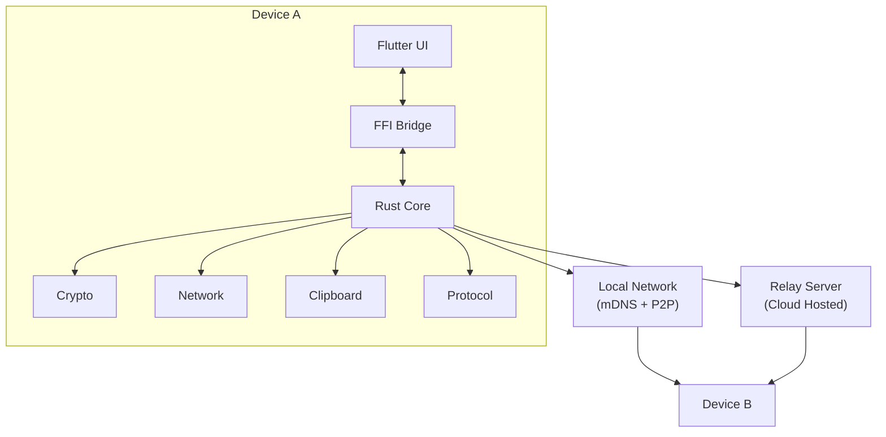
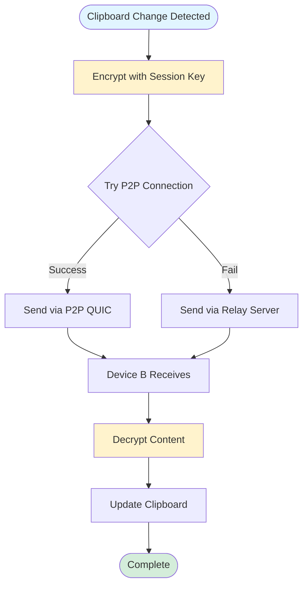
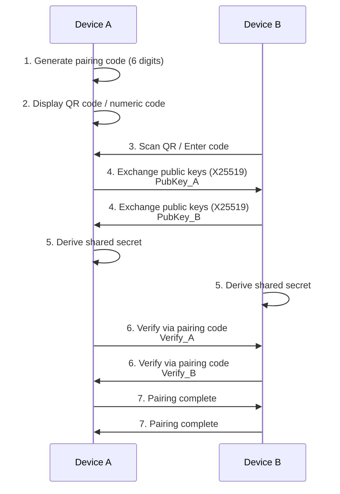
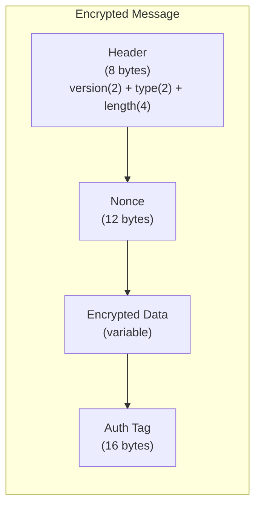
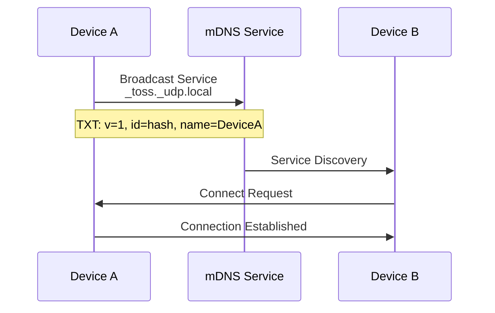
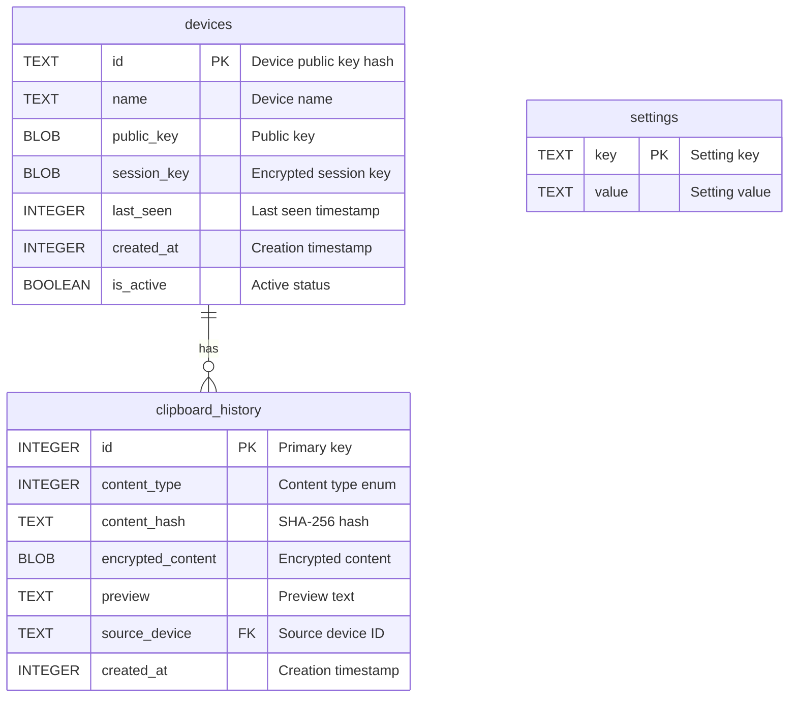

# Toss - Technical Specification

## 1. Overview

### 1.1 Purpose
**Toss** is a cross-platform application that synchronizes clipboard content between devices with end-to-end encryption. It prioritizes privacy, security, and seamless user experience.

### 1.2 Supported Platforms
- Windows 10/11
- macOS 11+
- Linux (X11 and Wayland)
- iOS 14+
- Android 10+

### 1.3 Supported Content Types
- Plain text
- Rich text (HTML/RTF)
- Images (PNG, JPEG, BMP, GIF)
- Files (with size limits)
- URLs (with metadata preview)

---

## 2. Architecture

### 2.1 System Components



### 2.2 Communication Flow



**Steps:**

1. **Device Discovery**
   - mDNS broadcast on local network
   - Relay server registration for remote access

2. **Connection Establishment**
   - Try direct P2P connection first (QUIC/UDP)
   - Fall back to relay server if P2P fails
   - NAT traversal using STUN/TURN-like techniques

3. **Data Synchronization**
   - Clipboard change detection
   - Encrypt content with session key
   - Transmit to paired devices
   - Decrypt and update local clipboard

---

## 3. Security Specification

### 3.1 Cryptographic Primitives

| Purpose | Algorithm | Key Size |
|---------|-----------|----------|
| Key Exchange | X25519 | 256-bit |
| Symmetric Encryption | AES-256-GCM | 256-bit |
| Key Derivation | HKDF-SHA256 | - |
| Message Authentication | HMAC-SHA256 | 256-bit |
| Device Identity | Ed25519 | 256-bit |

### 3.2 Key Management

#### 3.2.1 Device Identity Keys
- Generated on first launch
- Stored in platform secure storage (Keychain, Credential Manager, etc.)
- Never transmitted; only public key shared

#### 3.2.2 Session Keys
- Derived using X25519 key exchange during pairing
- Rotated periodically (every 24 hours or 1000 messages)
- Forward secrecy via ephemeral keys

### 3.3 Device Pairing Protocol



### 3.4 Message Encryption



### 3.5 Relay Server Security

- Relay sees only encrypted blobs
- No message content logging
- Device authentication via signed tokens
- Rate limiting per device
- Optional self-hosted relay

---

## 4. Network Protocol

### 4.1 Transport Layer

- **Primary**: QUIC (UDP-based, built-in encryption)
- **Fallback**: WebSocket over TLS (for restrictive networks)

### 4.2 Message Types

| Type | Code | Description |
|------|------|-------------|
| PING | 0x01 | Keepalive |
| PONG | 0x02 | Keepalive response |
| CLIPBOARD_UPDATE | 0x10 | New clipboard content |
| CLIPBOARD_ACK | 0x11 | Acknowledge receipt |
| CLIPBOARD_REQUEST | 0x12 | Request current clipboard |
| DEVICE_INFO | 0x20 | Device metadata exchange |
| KEY_ROTATION | 0x30 | Session key rotation |
| ERROR | 0xFF | Error message |

### 4.3 Clipboard Update Message

```rust
struct ClipboardUpdate {
    message_id: u64,
    timestamp: u64,           // Unix timestamp (ms)
    content_type: ContentType,
    content_hash: [u8; 32],   // SHA-256 of plaintext
    encrypted_content: Vec<u8>,
    metadata: Option<Metadata>,
}

enum ContentType {
    PlainText = 0,
    RichText = 1,
    Image = 2,
    File = 3,
    Url = 4,
}

struct Metadata {
    filename: Option<String>,
    mime_type: Option<String>,
    dimensions: Option<(u32, u32)>,  // For images
    preview: Option<Vec<u8>>,         // Thumbnail
}
```

### 4.4 Discovery Protocol (mDNS)



**Service Details:**
- Service type: `_toss._udp.local`
- TXT records:
  - `v=1` (protocol version)
  - `id=<device_id_hash>` (truncated device ID)
  - `name=<device_name>` (user-friendly name)

---

## 5. Data Storage

### 5.1 Local Database Schema



**SQL Schema:**

```sql
-- Paired devices
CREATE TABLE devices (
    id TEXT PRIMARY KEY,           -- Device public key hash
    name TEXT NOT NULL,
    public_key BLOB NOT NULL,
    session_key BLOB,              -- Encrypted with device master key
    last_seen INTEGER,
    created_at INTEGER,
    is_active BOOLEAN DEFAULT TRUE
);

-- Clipboard history (optional feature)
CREATE TABLE clipboard_history (
    id INTEGER PRIMARY KEY,
    content_type INTEGER,
    content_hash TEXT,
    encrypted_content BLOB,
    preview TEXT,                  -- For quick display
    source_device TEXT,
    created_at INTEGER,
    FOREIGN KEY (source_device) REFERENCES devices(id)
);

-- Settings
CREATE TABLE settings (
    key TEXT PRIMARY KEY,
    value TEXT
);
```

### 5.2 Secure Storage

| Platform | Storage Method |
|----------|----------------|
| macOS | Keychain Services |
| iOS | Keychain Services |
| Windows | Credential Manager / DPAPI |
| Linux | Secret Service API / libsecret |
| Android | Android Keystore |

---

## 6. User Interface

### 6.1 Main Screens

1. **Home / Dashboard**
   - Connection status indicator
   - List of paired devices (online/offline)
   - Current clipboard preview
   - Quick actions (send, clear)

2. **Device Pairing**
   - QR code display/scanner
   - Manual code entry
   - Pairing confirmation

3. **Clipboard History** (optional)
   - Chronological list of shared items
   - Search and filter
   - Re-copy to clipboard

4. **Settings**
   - Device name
   - Auto-sync toggle
   - Content type filters
   - History retention
   - Relay server configuration
   - Theme (light/dark/system)

### 6.2 System Tray / Menu Bar

- Status icon (connected/disconnected)
- Quick toggle sync on/off
- Recent clipboard items
- Open main window
- Quit application

### 6.3 Notifications

- New device pairing request
- Clipboard received (optional)
- Connection lost/restored
- Error alerts

---

## 7. Platform-Specific Implementation

### 7.1 macOS

- **Clipboard**: `NSPasteboard` API
- **Background**: `NSApplication` background mode
- **Permissions**: Accessibility permission for clipboard monitoring
- **Menu Bar**: Native `NSStatusItem`

### 7.2 Windows

- **Clipboard**: `Win32 Clipboard API` with `AddClipboardFormatListener`
- **Background**: System tray application
- **Startup**: Registry key for auto-start

### 7.3 Linux

- **Clipboard**: X11 (`xcb`) and Wayland (`wl-clipboard`) support
- **Background**: D-Bus service / systemd user service
- **Tray**: `libappindicator` or SNI protocol

### 7.4 iOS

- **Clipboard**: `UIPasteboard.general`
- **Background**: Limited; use app extensions and Shortcuts
- **Sync Trigger**: On app open, Share extension, Widget

### 7.5 Android

- **Clipboard**: `ClipboardManager`
- **Background**: Foreground service with notification
- **Restrictions**: Android 10+ limits background clipboard access

---

## 8. Relay Server Specification

### 8.1 API Endpoints

```
POST   /api/v1/register          # Register device
DELETE /api/v1/register          # Unregister device
POST   /api/v1/relay/{device_id} # Send message to device
GET    /api/v1/messages          # Poll for messages (WebSocket upgrade available)
GET    /api/v1/devices/{id}/status # Check device online status
```

### 8.2 Authentication

- Device signs requests with Ed25519 private key
- Server verifies signature with registered public key
- JWT tokens for session management

### 8.3 Rate Limits

| Endpoint | Limit |
|----------|-------|
| Register | 10/hour |
| Relay message | 100/minute |
| Poll messages | 60/minute |

### 8.4 Self-Hosting

- Dockerized deployment
- Environment-based configuration
- Optional TLS termination (or use reverse proxy)
- SQLite or PostgreSQL backend

---

## 9. Error Handling

### 9.1 Error Codes

| Code | Category | Description |
|------|----------|-------------|
| 1xxx | Network | Connection errors |
| 2xxx | Crypto | Encryption/decryption failures |
| 3xxx | Protocol | Invalid messages |
| 4xxx | Storage | Database errors |
| 5xxx | Platform | OS-specific errors |

### 9.2 Recovery Strategies

- **Network failure**: Automatic reconnection with exponential backoff
- **Crypto failure**: Request key re-exchange
- **Corrupted data**: Skip and log, don't crash
- **Storage full**: Clear old history, warn user

---

## 10. Performance Requirements

| Metric | Target |
|--------|--------|
| Text sync latency (local) | < 100ms |
| Text sync latency (relay) | < 500ms |
| Image sync (1MB, local) | < 1s |
| Memory usage (idle) | < 50MB |
| Battery impact (mobile) | Minimal (< 2%/day) |
| Max clipboard size | 50MB |

---

## 11. Testing Strategy

### 11.1 Unit Tests
- Crypto operations
- Protocol serialization
- Clipboard format handling

### 11.2 Integration Tests
- Device pairing flow
- Message encryption/decryption round-trip
- Network reconnection

### 11.3 End-to-End Tests
- Cross-platform clipboard sync
- Relay fallback
- Large file transfer

### 11.4 Security Tests
- Fuzz testing on protocol parser
- Crypto implementation verification
- Penetration testing on relay server

---

## 12. CI/CD Pipeline

### 12.1 Continuous Integration

**Triggers**: Every push and pull request

```yaml
# Rust checks
- cargo fmt --check          # Code formatting
- cargo clippy -- -D warnings # Linting
- cargo test                  # Unit tests
- cargo audit                 # Security vulnerabilities

# Flutter checks
- flutter analyze             # Static analysis
- flutter test                # Widget and unit tests
- flutter test --coverage     # Coverage report
```

### 12.2 Release Pipeline

**Triggers**: Version tags (`v*.*.*`)

| Platform | Build Artifact |
|----------|----------------|
| Windows | `toss-windows-x64.zip` (portable), `.msi` installer |
| macOS | `toss-macos-universal.dmg` (Intel + Apple Silicon) |
| Linux | `.AppImage`, `.deb`, `.rpm` |
| iOS | `.ipa` (TestFlight / App Store) |
| Android | `.apk`, `.aab` (Play Store) |

### 12.3 Code Quality Gates

- Minimum test coverage: 70%
- No clippy warnings
- No security vulnerabilities (cargo audit)
- All tests passing
- PR approval required

---

## 13. Future Considerations

- **Clipboard streaming**: Real-time sync for rapid changes
- **Selective sync**: Choose which devices receive updates
- **Team/Organization support**: Shared clipboard groups
- **Browser extension**: Web-based clipboard access
- **Conflict resolution**: Handle simultaneous clipboard changes
- **Compression**: Reduce bandwidth for large content
