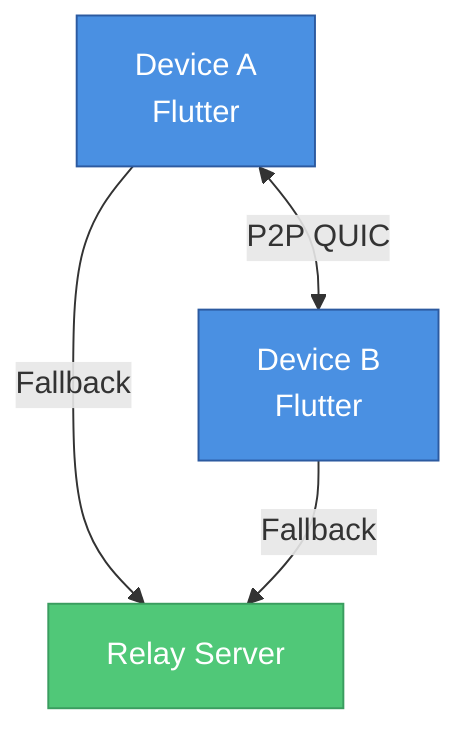

# Architecture

Toss uses a hybrid architecture for optimal performance and reliability.

## System Overview

## Core Components

### Rust Core

Handles encryption, networking, and clipboard operations:

- **Crypto**: X25519 key exchange, AES-256-GCM encryption
- **Network**: mDNS discovery, QUIC P2P, relay client
- **Clipboard**: Platform-specific clipboard access
- **Storage**: SQLite for device and history storage
- **Protocol**: Message serialization and wire protocol

### Flutter UI

Cross-platform user interface:

- **Services**: TossService, NotificationService, etc.
- **Providers**: State management with Riverpod
- **Features**: Home, Pairing, History, Settings screens
- **FFI Bridge**: Communication with Rust core

### Relay Server

Optional fallback for remote sync:

- WebSocket-based message relay
- Zero-knowledge (only sees encrypted blobs)
- Self-hostable

## Communication Flow

1. **Device Discovery**
   - mDNS broadcast on local network
   - Relay server registration for remote access

2. **Connection Establishment**
   - Try direct P2P connection first (QUIC/UDP)
   - Fall back to relay server if P2P fails
   - NAT traversal using STUN/TURN-like techniques

3. **Data Synchronization**
   - Clipboard change detection
   - Encrypt content with session key
   - Transmit to paired devices
   - Decrypt and update local clipboard

## Security Architecture

- **X25519** key exchange for secure device pairing
- **AES-256-GCM** authenticated encryption for all data
- **Ed25519** signatures for device identity
- **Zero-knowledge relay**: The relay server only sees encrypted blobs
- **Forward secrecy**: Session keys are rotated regularly

## Storage Architecture

- **Device Storage**: SQLite database for paired devices
- **History Storage**: Encrypted local clipboard history
- **Key Storage**: Platform secure storage (Keychain, Credential Manager)

## Next Steps

- [API Reference](api-reference.md) - API documentation
- [Platform Support](platform-support.md) - Platform-specific details
- [Testing](testing.md) - Testing guide
